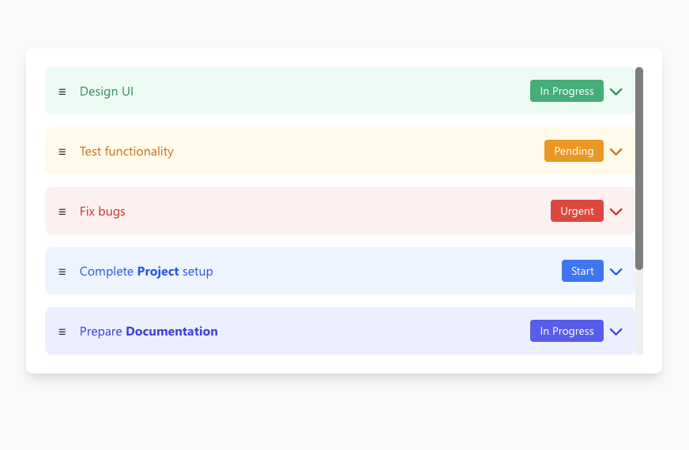

# TaskList

A custom PowerApps Component Framework (PCF) control developed by **Shaheer Ahmad**.

## Description

The **TaskList** component provides a customizable list interface for managing tasks within your Power Apps.

## Features

-   **Task Management**: Display and interact with a list of tasks.
-   **Customizable Typography**: Adjust the font size (`fontSize`) to match your app's design.
-   **Interactive**: Capture data updates via `UpdatedData`.

## Installation

1.  **Download Solution**:
    -   Download the managed solution file directly from this repository: [PCFTaskList_1_0_0_1_managed.zip](Solutions/PCFTaskList_1_0_0_1_managed.zip)

2.  **Import into Power Apps Environment**:
    -   Go to the [Power Apps Maker Portal](https://make.powerapps.com/).
    -   Select the correct **Environment** from the top right corner.
    -   Navigate to **Solutions** in the left sidebar.
    -   Click **Import solution** in the top menu.
    -   Browse and select the downloaded `PCFTaskList_1_0_0_1_managed.zip` file.
    -   Click **Next** and follow the prompts to complete the import.

3.  **Enable PCF for Canvas Apps**:
    -   *Note: This step is required for the "Code" tab to appear in the "Import components" dialog.*
    -   Go to the [Power Platform Admin Center](https://admin.powerplatform.microsoft.com/).
    -   Select your **Environment**.
    -   Navigate to **Settings** > **Product** > **Features**.
    -   Toggle **On** the setting **"Power Apps component framework for canvas apps"**.
    -   Save the changes.

4.  **Add to Canvas App**:
    -   Open your Canvas App in **Edit** mode.
    -   In the left sidebar, click on the **Insert** (+) icon.
    -   Click on the **Get more components** button at the bottom of the pane.
    -   In the "Import components" dialog, select the **Code** tab.
    -   Search for or scroll to find the **TaskList** component.
    -   Select it and click **Import**.
    -   Once imported, you will find **TaskList** under the **Code components** section in the Insert pane.
    -   Drag and drop it onto your screen.

## Usage

1.  Select the **TaskList** component on your canvas.
2.  Bind your task data to the `Data` property.
3.  Choose a preferred `fontSize` (Small, Medium, Large, ExtraLarge).

## Creator

**Shaheer Ahmad**
-   GitHub: [shaheerahmadch](https://github.com/shaheerahmadch)

## License

This project is licensed under the MIT License.
